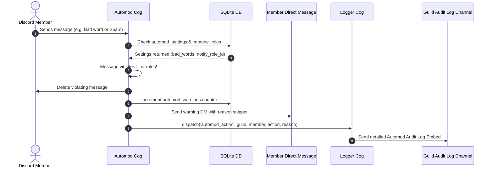
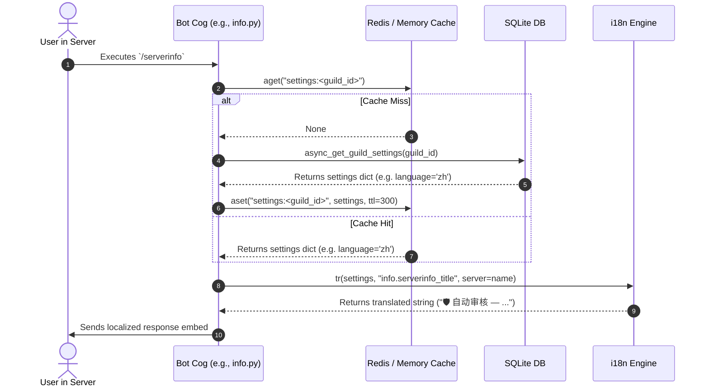

# ARCHITECTURE.md — ZerynBot V2 Core Architecture & Technical Reference

> **Target Audience:** AI Assistants & System Developers  
> **Purpose:** Provides a complete, zero-ambiguity structural reference, component map, data flow diagram, and development guidelines for **ZerynBot V2** to accelerate development, bug fixes, and feature additions.

---

## 1. System Overview & Technology Stack

**ZerynBot V2** is a modular, high-performance, multi-language Discord bot paired with an interactive Web Dashboard. It is specifically optimized to run on low-resource ARM hardware (e.g., Android Termux, Raspberry Pi, 4GB RAM tablets) while supporting multiple Discord servers concurrently.

```
                  ┌─────────────────────────────────────────┐
                  │              Discord API                │
                  └────┬───────────────────────────────▲────┘
                       │ Websocket / HTTP API          │ Interactions / Responses
                       ▼                               │
        ┌─────────────────────────────┐  ┌─────────────┴───────────────┐
        │   Discord Bot Engine        │  │     Web Dashboard           │
        │   (discord.py + app_cmd)    │  │     (Flask + Jinja2)        │
        └──────────────┬──────────────┘  └─────────────┬───────────────┘
                       │                               │
                       │ Async DB                      │ Sync DB
                       ▼                               ▼
        ┌──────────────────────────────────────────────────────────────┐
        │            SQLite Database (data/bot.db)                     │
        │            (WAL Mode + PRAGMA Busy Timeout)                  │
        └──────────────────────────────┬───────────────────────────────┘
                                       │
                        ┌──────────────┴──────────────┐
                        │     Redis Cache Wrapper     │
                        │    (Fallback to Direct DB)  │
                        └─────────────────────────────┘
```

### Core Tech Stack:
- **Bot Engine:** Python 3.10+, `discord.py` v2.x (`app_commands` for Slash commands + hybrid prefix fallback).
- **Web Dashboard:** Flask, Jinja2 Templates, Discord OAuth2 (`identify guilds` scopes).
- **Database:** SQLite (`data/bot.db`) configured with `PRAGMA journal_mode=WAL` & `synchronous=NORMAL`.
  - **Async Access (Bot):** `aiosqlite` via `database.py` `async_*` functions.
  - **Sync Access (Dashboard):** `sqlite3` via `database.py` sync helper functions.
- **Cache Layer:** Redis (`redis-py` & `redis.asyncio` in `cache.py`) with silent fallback to direct SQLite queries when Redis is unavailable.
- **Image Generation:** Pillow (`PIL`) in `card_generator.py` for rendering dynamic rank cards and welcome/goodbye banner cards in thread pools.
- **Audio Pipeline:** `yt-dlp` + `FFmpegOpusAudio` optimized for ARM (`-threads 1 -b:a 96k`).
- **i18n Engine:** RAM-cached O(1) translation lookup engine supporting 6 languages (`vi`, `en`, `zh`, `es`, `pt`, `fr`).

---

## 2. Directory Structure & File Map

```
d:/Project/Discord Bots/v2/
├── ARCHITECTURE.md             # This document (AI Context Map & System Reference)
├── main.py                     # Primary process orchestrator & CLI control (start/stop/restart/status)
├── config.py                   # Centralized environment variables, credentials, and constants
├── database.py                 # SQLite schema, sync (Flask) & async (Bot) database helper methods
├── cache.py                    # Redis cache wrapper with dual sync/async API & silent fallback
├── i18n.py                     # Singleton O(1) multi-language translation engine
├── start.sh                    # Linux/ARM startup shell script
├── requirements.txt            # Python package dependencies
│
├── bot/                        # Discord Bot Application
│   ├── bot.py                  # Bot class initialization, event logging webhook, health-check
│   ├── card_generator.py       # PIL dynamic image rendering (Rank Card, Welcome/Goodbye banners)
│   ├── checks.py               # Permissions & Bot Admin checks
│   ├── tester.py               # Standalone test/debug helper script
│   ├── fonts/                  # Custom TrueType fonts (.ttf) for card rendering
│   └── cogs/                   # Modular Bot Feature Cogs (14 total)
│       ├── admin.py            # Bot owner global administration, slash command sync
│       ├── automod.py          # Real-time message filter (spam, bad words, fake links, caps, pings)
│       ├── autorole.py         # On-member-join role auto-assignment
│       ├── events.py           # Join/leave event listeners, guild cache, banner delivery
│       ├── giveaway.py         # Giveaway creation, join views, background timer loop
│       ├── info.py             # Server, user, avatar, bot, role, channel info embeds
│       ├── lang.py             # /lang language picker slash command
│       ├── leveling.py         # Chat & Voice XP engine, rank calculation, level rewards
│       ├── logger.py           # Server audit log events listener & embed logger
│       ├── music.py            # ARM-optimized audio player (YT-DLP, FFmpeg, Playlists, Lofi)
│       ├── reactionroles.py    # Reaction role listener & interactive button handler
│       ├── stats.py            # Hourly event metrics collector for dashboard analytics
│       ├── ticket.py           # Support ticket panel creation, persistent views, channel setup
│       └── utility.py          # Ping, membercount, multi-language /help menu view, poll, roll
│
├── dashboard/                  # Flask Web Management Dashboard
│   ├── app.py                  # Flask routes, OAuth2 handlers, server module controllers
│   ├── api.py                  # AJAX JSON endpoints for live previews, roles, channels
│   ├── auth.py                 # Discord OAuth2 session token exchange & helper functions
│   ├── static/                 # CSS styles, JS assets, branding images
│   └── templates/              # Jinja2 HTML templates
│       ├── base_server.html    # Primary dashboard layout shell
│       ├── admin.html          # Bot owner global control panel
│       ├── server_automod.html # Automod configuration page
│       ├── server_autoroles.html# Auto Roles configuration page
│       ├── server_leveling.html# Leveling & XP rewards page
│       ├── server_logger.html  # Audit Logger configuration page
│       ├── tickets.html        # Ticket System panel builder page
│       ├── reactionroles.html  # Reaction Roles panel builder page
│       ├── music.html          # Server music playlists & settings page
│       ├── welcome.html        # Welcome & Goodbye card preview & settings page
│       └── ...                 # Additional templates (home, login, embeds, commands, tos, privacy)
│
├── locales/                    # i18n Translation Dictionaries (JSON)
│   ├── vi.json                 # Vietnamese (Default) — 865 keys
│   ├── en.json                 # English — 865 keys
│   ├── zh.json                 # Chinese — 865 keys
│   ├── es.json                 # Spanish — 865 keys
│   ├── pt.json                 # Portuguese — 865 keys
│   └── fr.json                 # French — 865 keys
│
├── scripts/                    # Maintenance & Operations Scripts
│   ├── send_status.py          # Discord Webhook status notifier script
│   ├── termux_boot.sh          # Android Termux boot auto-start script
│   └── watchdog.sh             # Background process health watchdog script
│
└── data/                       # Persistent Data Storage (git-ignored)
    ├── bot.db                  # SQLite database file
    ├── bot.log                 # Rotating file log
    └── health.json             # Heartbeat file for external watchdog
```

---

## 3. Core Database Schema (`data/bot.db`)

The database uses SQLite in **WAL (Write-Ahead Logging)** mode. All tables are created automatically on startup by `init_db()` in `database.py`.

### Primary Tables & Schema Summary:

| Table Name | Primary Key | Description & Key Columns |
|------------|-------------|---------------------------|
| `guilds` | `guild_id` | Core server settings, `welcome_*` config, `goodbye_*` config, `language` (default `'vi'`), `autoroles_user`, `autoroles_bot`, `bot_admin_roles`. |
| `guild_modules` | `(guild_id, module_name)` | Feature toggles per server (`enabled` = 1 or 0). Modules: `utility`, `welcome_goodbye`, `info`, `music`, `tickets`, `autoroles`, `reactionroles`, `automods`, `leveling`. |
| `guild_channels` | `(guild_id, channel_id)` | Cached text/voice channels for dashboard dropdown selectors. |
| `guild_roles` | `(guild_id, role_id)` | Cached server roles with color hex & hierarchy position. |
| `guild_meta` | `guild_id` | Cached server metadata (name, icon URL, member count). |
| `saved_embeds` | `id` | Custom embeds created via Dashboard Embed Builder. |
| `ticket_panels` | `id` | Support ticket panels (channel, message ID, title, support role). |
| `ticket_buttons` | `id` | Category buttons attached to a ticket panel (`panel_id` FK). |
| `reaction_roles_panels` | `id` | Reaction role panels (`message_id`, `channel_id`, custom embed info). |
| `reaction_roles_items` | `id` | Emoji to Role mappings attached to a reaction panel (`panel_id` FK). |
| `music_playlists` | `id` | Guild custom music playlists (`name`, `creator_id`). |
| `music_playlist_tracks` | `id` | Track entries in a music playlist (`url`, `title`, `duration`, `thumbnail`). |
| `automod_settings` | `guild_id` | `spam_enabled`, `bad_words_enabled`, `links_enabled`, `anti_invite_enabled`, `anti_caps_enabled`, `anti_mentions_enabled`, `bad_words` JSON list, `blacklist_links` JSON list, `whitelist_links` JSON list, `immune_roles` JSON list, `spam_allowed_channels` JSON list, `notify_role_id`, `log_channel_id`, `timeout_duration_minutes`. |
| `automod_warnings` | `id` | Log of user Automod warning counts per server. |
| `leveling_settings` | `guild_id` | `message_xp_min` (15), `message_xp_max` (25), `voice_xp` (10), `announce_channel_id`, `announce_message`, `stack_rewards`. |
| `user_levels` | `(guild_id, user_id)` | User XP, level, `last_message_at` timestamp, `last_voice_xp_at` timestamp. |
| `level_roles` | `(guild_id, level, role_id)` | Reward roles unlocked at specific level milestones. |
| `logger_settings` | `guild_id` | Event toggles for message edit/delete, member join/leave, kick/ban, role changes, channel edits, automod, tickets. |
| `guild_stats` | `(guild_id, event_type, event_label, date_hour)` | Metric counters for analytics charts (hourly aggregation). |
| `giveaways` | `id` | Active/ended giveaways (`prize`, `end_at`, `ended`, `participants_json`). |
| `guild_blacklist` | `guild_id` | Banned server list (blacklisted servers are auto-left by the bot). |

---

## 4. Internationalization (i18n) Engine

The i18n engine (`i18n.py`) provides fast, zero-I/O O(1) translation lookup by loading all JSON files from `locales/` into memory at startup.

### Fallback Chain:
`Requested Language Code` ➔ `DEFAULT_LANG ('vi')` ➔ `Default Parameter` ➔ `Key String`

```
  [Key Request: "music.now_playing"]
                 │
                 ▼
     Does requested lang exist in RAM? ──NO──► Check 'vi' dictionary
                 │ YES                                │
                 ▼                                    │ YES
     Is key in lang dict? ─────────────NO─────────────┤
                 │ YES                                │
                 ▼                                    ▼
       Return Translated Text               Return 'vi' Fallback Text
```

### Usage Patterns:
1. **Bot Python Code (`tr` function):**
   ```python
   from database import async_get_guild_settings
   from i18n import tr

   settings = await async_get_guild_settings(str(ctx.guild.id))
   await ctx.send(tr(settings, "music.added_to_queue", title=song_title, url=song_url))
   ```
2. **Dashboard Jinja2 Templates (`t` filter):**
   ```jinja2
   {# In Flask routes, `t()` is injected into Jinja2 context via app.jinja_env.globals #}
   {# The dashboard currently displays the UI in the server's language or 'vi' by default #}
   <h1>{{ t('admin.page_title') }}</h1>
   <p>{{ t('automod.sec_features') }}</p>
   ```
   > **Note:** Dashboard uses the `t(key)` function (no explicit lang arg needed in templates — lang is pulled from the server's `guild.language` setting injected via Flask's `g` context).

---

## 5. Cog Ecosystem & Feature Responsibilities

```
                          ┌──────────────────────────┐
                          │    discord.py BotV2      │
                          └────────────┬─────────────┘
                                       │
   ┌───────────────────┬───────────────┼───────────────┬───────────────────┐
   │                   │               │               │                   │
   ▼                   ▼               ▼               ▼                   ▼
automod.py          events.py      music.py        ticket.py          leveling.py
(Filter Msg &      (Join/Leave     (Audio Queue    (Support Panels    (Chat & Voice XP
 Dispatch Action)   Banners Card)   & YT-DLP)       & Channels)        Rank Cards)
```

| Cog Name | File Path | Primary Responsibilities & Key Event Listeners |
|----------|-----------|------------------------------------------------|
| **Admin** | `bot/cogs/admin.py` | Slash command sync (`/sync`), global broadcast, reload extensions. |
| **Automod** | `bot/cogs/automod.py` | `on_message` scan: sliding window spam check, keyword filter, URL regex, invite filter, CAPS check, mass ping. Triggers warn/timeout and dispatches `automod_action`. |
| **AutoRole** | `bot/cogs/autorole.py` | `on_member_join`: assigns configured bot/human roles automatically. |
| **Events** | `bot/cogs/events.py` | `on_member_join` & `on_member_remove`: generates dynamic Pillow welcome/goodbye banner card (or fallback embed), caches guild structure (`_cache_guild`), enforces guild blacklist. |
| **Giveaway** | `bot/cogs/giveaway.py` | `/giveaway start/end/reroll`. Runs `giveaway_loop` (every 15s) with `ended == 1` double-check to prevent double-ending race conditions. Uses field index 2 for live participant count edits. |
| **Info** | `bot/cogs/info.py` | `/serverinfo`, `/userinfo`, `/avatar`, `/botinfo`, `/roleinfo`, `/channelinfo`. Fully localized badge and verification level mappers. |
| **Lang** | `bot/cogs/lang.py` | `/lang` hybrid command to change guild language in SQLite & invalidate cache. |
| **Leveling** | `bot/cogs/leveling.py` | Message XP (60s cooldown per user), `voice_xp_task` (90s batch interval loop for non-muted voice members), reward role assignment (`stack_rewards` logic), rank card Pillow generator fallback. Uses `leveling.xp_*` namespace. |
| **Logger** | `bot/cogs/logger.py` | Listens to Discord audit events: message edit/delete, member join/leave/kick/ban, role updates, channel edits, automod violations (`on_automod_action`), ticket actions (`on_ticket_action`). |
| **Music** | `bot/cogs/music.py` | yt-dlp + `FFmpegOpusAudio` playback manager. Controls `MusicPlayer` instances (`MAX_PLAYERS = 6`), `MusicControlView` (Pause, Skip, Stop, Loop buttons), Lofi 24/7 streams (SomaFM & YouTube), custom playlists. |
| **ReactionRoles** | `bot/cogs/reactionroles.py` | Listens for raw reaction add/remove and button interactions to toggle configured roles. |
| **Stats** | `bot/cogs/stats.py` | Listens to `on_message`, `on_member_join`, `on_automod_action`, `on_ticket_action` and writes aggregated hourly counters to `guild_stats`. |
| **Ticket** | `bot/cogs/ticket.py` | Dynamic ticket panel setup with persistent views (`DynamicTicketView`), ticket channel creation with strict member permission overrides, close/delete countdown. Dispatches `ticket_action`. |
| **Utility** | `bot/cogs/utility.py` | `/ping`, `/membercount`, `/help` (multi-language interactive `HelpSelect` and `HelpView`), `/poll`, `/roll`, `/choose`. |

---

## 6. Dashboard Architecture (Flask)

The web dashboard is hosted via Flask in `dashboard/app.py` and `dashboard/api.py`.

```
                    ┌──────────────────────────────┐
                    │      Flask App (app.py)      │
                    └──────────────┬───────────────┘
                                   │
         ┌─────────────────────────┼─────────────────────────┐
         │                         │                         │
         ▼                         ▼                         ▼
   OAuth2 Authentication     Server Management Views    AJAX API Endpoints
   (/login, /callback)       (/server/<id>/<module>)    (api.py)
```

- **Authentication (`auth.py`):** Uses Discord OAuth2 code exchange (`/callback`). Stores user token, ID, username, avatar, and managed guild list in Flask session (`session['user']`).
- **Authorization (`@login_required`, `@guild_admin_required`):** Checks if the authenticated user has `ADMINISTRATOR` or `MANAGE_GUILD` permission on the requested Discord server.
- **Module Toggle API:** Endpoints like `/server/<guild_id>/module/<module_name>` toggle modules on/off in `guild_modules` table and clear Redis cache immediately.
- **Bot Owner Admin Panel (`/admin`):** Access restricted to `config.BOT_OWNER_ID`. Allows viewing all active servers, launching global broadcasts, kicking the bot from toxic servers, managing the server blacklist, executing shell commands via the **Web Terminal** (`/admin/system/terminal`), updating code via **Git Pull** (`/admin/system/git-pull`), and triggering system restarts (`/admin/system/restart`).

---

## 7. Cross-Component Workflows & Data Flows

### Workflow 1: Automod Violation & Audit Logging



### Workflow 2: Multi-Language Slash Command Execution



---

## 8. Resource & Hardware Optimization Guidelines (ARM / Low RAM)

ZerynBot V2 is optimized to run reliably on weak ARM devices (such as 4GB RAM Android tablet/TV box or Raspberry Pi):

1. **Audio Encoding Optimization:**
   - Always use `FFmpegOpusAudio` rather than `FFmpegPCMAudio`. This offloads re-encoding overhead and reduces CPU usage by ~50%.
   - Single-threaded FFmpeg flags: `-threads 1 -b:a 96k`.
2. **Concurrency Limits:**
   - `MAX_PLAYERS = 6` limit in `music.py` prevents out-of-memory crashes when multiple servers request music simultaneously.
3. **Database I/O:**
   - SQLite uses `PRAGMA journal_mode=WAL` and `synchronous=NORMAL`.
   - Bot functions **must** use `aiosqlite` thread pool executors (`database.py` async methods) to keep the Discord gateway heartbeats responsive.
4. **Health Check & External Watchdog:**
   - Bot periodically updates `data/health.json` via non-blocking async executor.
   - External script `scripts/watchdog.sh` polls `data/health.json`. If the timestamp is stale (>5 minutes), it automatically restarts the process.

---

## 9. Developer & AI Maintenance Rules

When editing or extending the ZerynBot V2 codebase, **you must strictly follow these rules**:

1. **i18n Translation Integrity:**
   - **NEVER** hardcode user-facing strings in Python cogs or HTML templates.
   - When adding a new `tr()` key, add it to **ALL 6 locale JSON files** (`vi.json`, `en.json`, `zh.json`, `es.json`, `pt.json`, `fr.json`).
   - All 6 locale files must always contain the **same number of keys**. If you add 1 key to `vi.json`, add the translated equivalent to the other 5 immediately.
2. **Async vs. Sync Separation:**
   - **Bot code (`bot/cogs/`)** MUST use async database functions (`async_get_guild_settings`, `async_is_module_enabled`, etc.).
   - **Dashboard code (`dashboard/`)** MUST use sync database functions (`get_guild_settings`, `is_module_enabled`, etc.).
3. **Module Guard Pattern (mandatory in every cog command):**
   ```python
   # Check if the module is enabled before running any command logic:
   if not await async_is_module_enabled(str(ctx.guild.id), "music"):
       return await ctx.reply(tr(settings, "common.module_disabled"), ephemeral=True)
   ```
   Without this guard, commands will execute even if the server admin has disabled that module.
4. **Cache Invalidation After Write:**
   - After any `UPDATE`/`INSERT` to `guilds`, `guild_modules`, or `automod_settings`, always call `await cache.adelete(f"settings:{guild_id}")` or equivalent to prevent stale settings being served.
5. **Race Condition Prevention in Async Loops:**
   - In background loops (such as `giveaway_loop` or `voice_xp_task`), always re-query database record state before modifying or rolling rewards to prevent duplicate execution.
6. **Frontend JavaScript Cleanliness:**
   - Ensure script blocks in Jinja2 HTML templates have valid JS syntax and no duplicate function declarations in the global scope.
   - Never define `window.I18N_*` variables inside a function body — declare them at the top-level script scope so all functions can access them.

---

## 10. Common Gotchas & Anti-Patterns for AI

These are known past bugs and traps that **MUST** be avoided when editing this codebase:

| # | Anti-Pattern | Correct Approach |
|---|--------------|------------------|
| 1 | Hardcoding translated text like `"Chống Spam"` inside a `.py` cog | Always use `tr(settings, "automod.feat_spam")` |
| 2 | Copying `vi.json` value directly into `en.json`/`zh.json` without translating | Translate the value into the target language properly |
| 3 | Using `music.*` keys inside `leveling.py` | Use `leveling.*` namespace — e.g. `leveling.xp_added` |
| 4 | Matching embed field names by string (e.g. `"Số người tham gia"`) to update participant count | Use **index-based** field access: `embed.fields[2]` |
| 5 | Calling `roll_giveaway()` without re-checking `ended == 1` in the background loop | Always re-fetch the DB row inside `giveaway_loop` before rolling to prevent duplicate endings |
| 6 | Declaring `function foo()` twice in same `<script>` block in HTML templates | Causes a `SyntaxError` that silently breaks all JS on the page |
| 7 | Using sync DB call (`get_guild_settings`) inside an async bot cog | Always use `await async_get_guild_settings(...)` in bot code |
| 8 | Forgetting to call `await cache.adelete(...)` after writing new settings | Old settings will be served from Redis cache (TTL = 300s) |
| 9 | Defining `window.I18N_*` inside a function body in admin.html | Define it at top-level script scope so all modal functions can access it |
| 10 | Executing interactive TTY commands (`nano`, `vim`, `top`) in Web Console | Use non-interactive commands like `cat <file>` to view file contents |
| 11 | Calling `subprocess.run(..., shell=True)` on Termux without `executable` parameter | Pass `executable=shutil.which("bash") or shutil.which("sh")` because `/bin/sh` does not exist on Termux |
