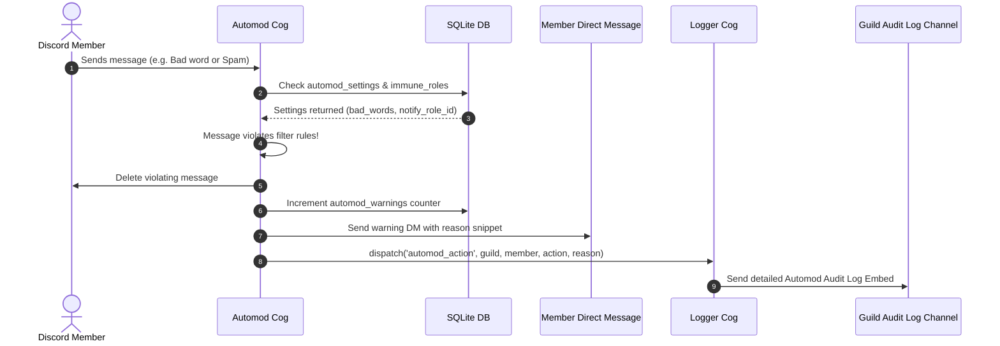
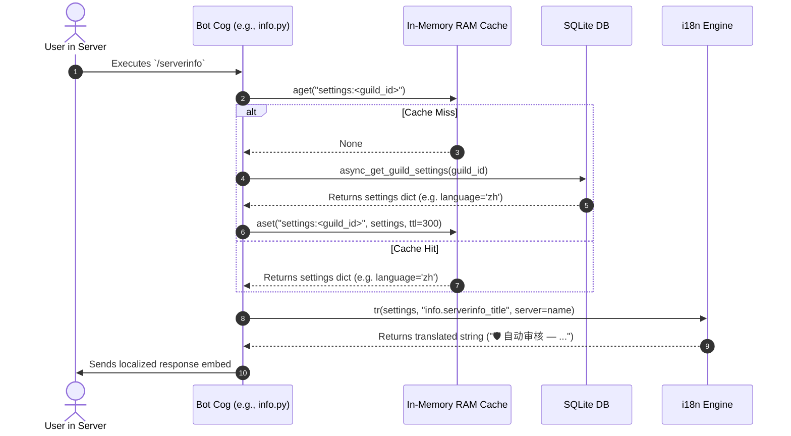

# ARCHITECTURE.md — ZerynBot V2 Core Architecture & Technical Reference

> **Target Audience:** AI Assistants & System Developers  
> **Purpose:** Provides a complete, zero-ambiguity structural reference, component map, data flow diagram, and development guidelines for **ZerynBot V2** to accelerate development, bug fixes, and feature additions.

---

## 1. System Overview & Technology Stack

**ZerynBot V2** is a modular, high-performance, multi-language Discord bot paired with an interactive Web Dashboard. It is specifically optimized to run on low-resource ARM hardware (e.g., Android Termux, Raspberry Pi, 4GB RAM tablets) while supporting multiple Discord servers concurrently.

```
                  ┌─────────────────────────────────────────┐
                  │              Discord API                │
                  └────┬───────────────────────────────▲────┘
                       │ Websocket / HTTP API          │ Interactions / Responses
                       ▼                               │
        ┌─────────────────────────────┐  ┌─────────────┴───────────────┐
        │   Discord Bot Engine        │  │     Web Dashboard           │
        │   (discord.py + app_cmd)    │  │     (Flask + Jinja2)        │
        └──────────────┬──────────────┘  └─────────────┬───────────────┘
                       │                               │
                       │ Async DB                      │ Sync DB
                       ▼                               ▼
        ┌──────────────────────────────────────────────────────────────┐
        │            SQLite Database (data/bot.db)                     │
        │            (WAL Mode + PRAGMA Busy Timeout)                  │
        └──────────────────────────────┬───────────────────────────────┘
                                       │
                        ┌──────────────┴──────────────┐
                        │  In-Memory RAM Cache (RAM)  │
                        │    (Pure Python MemoryCache)│
                        └─────────────────────────────┘
```

### Core Tech Stack:
- **Bot Engine:** Python 3.10+, `discord.py` v2.x (`app_commands` for Slash commands + hybrid @mention fallback).
- **Command prefix policy (P0):** prefix duy nhất là **@mention bot** (`commands.when_mentioned`). Tiền tố `/` đã bị bỏ vì nó khiến mọi lệnh hybrid gọi được bằng tin nhắn thường, vòng qua `app_commands.default_permissions`.
- **Per-subcommand checks (P0):** `discord.py` không cho lệnh con thừa hưởng check của `hybrid_group` (`commands.core.Command.can_run` chỉ duyệt `self.checks`), nên mọi lệnh con nhạy cảm tự gắn `checks.*` (dual-mode: prefix + slash). Xem `tests/test_command_permissions.py`.
- **Web Dashboard:** Flask, Jinja2 Templates, Discord OAuth2 (`identify guilds` scopes).
- **Database:** SQLite (`data/bot.db`) configured with `PRAGMA journal_mode=WAL` & `synchronous=NORMAL`.
  - **Async Access (Bot):** `aiosqlite` via the `database/` package `async_*` functions (per-domain modules, all connections opened by `database/conn.py`).
  - **Sync Access (Dashboard):** `sqlite3` via the `database/` package sync helper functions.
- **Cache Layer:** Pure Python In-Memory RAM Cache (`MemoryCache` in `cache.py`) with thread-safe/async-safe TTL eviction & zero external service dependencies.
- **Audio Pipeline:** `yt-dlp` (`player_client: ["android"]`) + `FFmpegOpusAudio` optimized for ARM (`-threads 1 -rw_timeout 10000000 -fflags +genpts -probesize 512K -analyzeduration 500000`), subprocess CPU priority niceness (+10) to prevent async event loop starvation, queue length clamping (`MAX_QUEUE_SIZE = 100`), thread-safe `threading.local` yt-dlp instances, dynamic 403 / stream expire auto-recovery with `-ss <elapsed>` resume, dual-tier caching (RAM Cache + compact SQLite disk cache `music_song_cache` with 7-day auto-prune, < 0.5 KB/song), resilient playlist loading with title fallback and burst rate limit protection, and rich queue management (`/seek`, `/search`, `/remove`, `/clearqueue`, `/jump`).
- **DevOps & MCP:** Model Context Protocol integration (`C:\Users\Nam\.gemini\antigravity-ide\mcp_config.json`) supporting SQLite inspection (`mcp-server-sqlite`) and remote Termux management (`scripts/termux_mcp.py` over Paramiko SSH port 8022).
- **Security & Concurrency Defense:** Defense-in-depth SSRF protection with real DNS resolution (`socket.getaddrinfo`), loopback/private/decimal IP filtering, 5MB streaming limits, and manual redirect inspection; Stored XSS immunity in Embed Builder via DOM `textContent` and protocol validation; Cross-Guild IDOR isolation via `member.guild.get_channel()`; Atomic Conditional SQL Updates (`WHERE wallet >= ?`) and single-connection transaction isolation preventing SQLite deadlocks.
- **i18n Engine:** RAM-cached O(1) translation lookup engine supporting 6 languages (`vi`, `en`, `zh`, `es`, `pt`, `fr`) with 1694 keys per file.

---

## 2. Directory Structure & File Map

```
ZerynBot/                    # (thư mục gốc repo — clone về bất kỳ đường dẫn nào)
├── ARCHITECTURE.md             # This document (AI Context Map & System Reference)
├── main.py                     # Primary process orchestrator & CLI control (start/stop/restart/status)
├── config.py                   # Centralized environment variables, credentials, and constants
├── database/                   # Modular SQLite database package (14 modules, WAL mode, async & sync)
│   ├── __init__.py             # Public API facade (100% backward-compatible re-exports)
│   ├── conn.py                 # Central DB_PATH, set_db_path(), _connect_sync(), _connect_async(), PRAGMA tuning
│   ├── schema.py               # init_db(), CREATE TABLE IF NOT EXISTS (46 tables), safe ALTER TABLE migrations
│   ├── guilds.py               # Guild settings, module toggles, channels/roles cache, blacklist
│   ├── economy.py              # Wallet, bank, shop, inventory, transfer, atomic cooldowns & transactions
│   ├── leveling.py             # Chat/voice XP formulas, rank calculations, level roles
│   ├── music.py                # Music playlists, song cache, top played songs
│   ├── activity.py             # Activity logs, guild stats aggregation
│   ├── community.py            # Giveaways, marriages, birthdays, custom commands, tempvoice
│   ├── events.py               # Automod settings & warnings, audit logger settings
│   ├── tickets.py              # Ticket panels, buttons, reaction roles panels & items
│   ├── ai.py                   # AI settings, global settings, AI activity logs
│   ├── maintenance.py          # Auto-prune jobs, threshold VACUUM, WAL checkpoints
│   └── embeds.py               # Saved rich embeds registry
├── cache.py                    # Thread-safe & async-safe In-Memory RAM Cache manager
├── i18n.py                     # Singleton O(1) multi-language translation engine
├── requirements.txt            # Python package dependencies
│
├── bot/                        # Discord Bot Application
│   ├── bot.py                  # Bot class initialization, event logging webhook, health-check
│   ├── card_generator.py       # PIL dynamic image rendering (Rank Card, Welcome/Goodbye banners)
│   ├── checks.py               # Permissions & Bot Admin checks
│   ├── giveaway_banner.png     # Pre-rendered dark giveaway header banner
│   ├── tester.py               # Standalone test/debug helper script
│   ├── fonts/                  # Custom TrueType fonts (.ttf) for card rendering
│   ├── emojis.py               # Custom Discord Application Emojis registry & helpers (e, partial)
│   ├── music/                  # Modular Audio Pipeline Package
│   │   ├── __init__.py         # Re-exports config, Track, MusicPlayer, views
│   │   ├── config.py           # FFmpeg flags, yt-dlp options, MAX_PLAYERS=6, MAX_QUEUE_SIZE
│   │   ├── extractor.py        # yt-dlp thread-local, disk cache, Spotify/SoundCloud resolver
│   │   ├── player.py           # Track metadata, MusicPlayer queue, 403 stream auto-recovery
│   │   ├── views.py            # MusicControlView (5 buttons), SearchSelectView, lyrics paginator
│   │   ├── embeds.py           # Now Playing & Queue Rich Embed generators
│   │   └── cog_voice.py        # VoiceLifecycleMixin (voice client lifecycle, queue actions, inactivity)
│   └── cogs/                   # Modular Bot Feature Cogs (24 total)
│       ├── admin.py            # Bot owner global administration, slash command sync, /backup & 24h auto-backup
│       ├── ai.py               # Multi-provider AI assistant (Groq Qwen 3.8 27B / Gemini / OpenRouter), /ask, /summarize
│       ├── automod.py          # Real-time message filter (spam, bad words, fake links, caps, pings, anti-raid/nuke)
│       ├── autorole.py         # On-member-join role auto-assignment
│       ├── birthday.py         # Birthday system (/birthday set/check/list/remove, midnight loop, VIP role, rewards)
│       ├── customcommands.py   # Custom commands & Auto-responders with variable replacements
│       ├── economy.py          # /daily streak, wallet, bank, /pay, /slots, /coinflip, /blackjack, /shop, /work...
│       ├── events.py           # Join/leave event listeners, guild cache, banner delivery
│       ├── fun.py              # Anime GIF interactions (10 actions via nekos.best), /ship, /marry, /divorce, /profile
│       ├── giveaway.py         # Essential Bot style Giveaway (banner header, key-value fields, live counter)
│       ├── info.py             # Server, user, avatar, bot, role, channel info embeds
│       ├── lang.py             # /lang language picker slash command
│       ├── leveling.py         # Chat & Voice XP engine, rank calculation, level rewards
│       ├── logger.py           # Server audit log events listener & embed logger
│       ├── maintenance.py      # Scheduled auto-prune background task (old logs, stats, warnings)
│       ├── moderation.py       # Moderation suite (/kick, /ban, /unban, /timeout, /warn, /clear, /slowmode...)
│       ├── music.py            # Music Cog controller inheriting VoiceLifecycleMixin (11 slash commands)
│       ├── reactionroles.py    # Reaction role listener & interactive button handler
│       ├── remind.py           # Smart Reminders & Scheduling (/remindme, /reminders, /delreminder)
│       ├── stats.py            # Hourly event metrics collector for dashboard analytics
│       ├── tempvoice.py        # Temporary Voice channels (Join-to-Create hub, in-chat button controls)
│       ├── ticket.py           # Support ticket panel creation, persistent views, channel setup
│       ├── utility.py          # Ping, membercount, 17-category interactive /help Command Center, poll...
│       └── verify.py           # Verification gate (/setup_verify, /verify panel, anti-raid & anti-nuke)
│
├── dashboard/                  # Flask Web Management Dashboard
│   ├── app.py                  # Entrypoint facade / compat shim (`app = create_app()` + re-exports cho main.py & tests)
│   ├── app_factory.py          # Flask application factory, error handlers, blueprint registration
│   ├── extensions.py           # Flask-Limiter and shared extensions initialization
│   ├── web_helpers.py          # Server context builder, channel sanitizers, auth decorators
│   ├── api.py                  # AJAX JSON endpoints for live previews, roles, channels
│   ├── auth.py                 # Discord OAuth2 session token exchange & helper functions
│   ├── blueprints/             # Modular route blueprints
│   │   ├── public.py           # Landing, login/logout, OAuth2 callback, /docs, /stats, status
│   │   ├── guild.py            # Guild modules toggle, settings, welcome/autorole/automod/embed builder
│   │   ├── music.py            # Web music player & playlist manager
│   │   ├── admin.py            # Bot Owner Admin panel, terminal, AI settings, activity console
│   │   └── support.py          # 24/7 Web Messenger Support ticket thread system
│   ├── static/                 # CSS styles, JS assets, branding images
│   └── templates/              # Jinja2 HTML templates
│
├── locales/                    # i18n Translation Dictionaries (JSON)
│   ├── vi.json                 # Vietnamese (Default) — 1694 keys
│   ├── en.json                 # English — 1694 keys
│   ├── zh.json                 # Chinese — 1694 keys
│   ├── es.json                 # Spanish — 1694 keys
│   ├── pt.json                 # Portuguese — 1694 keys
│   └── fr.json                 # French — 1694 keys
│
├── scripts/                    # Maintenance & Operations Scripts
│   ├── send_status.py          # Discord Webhook status notifier script
│   ├── termux_boot.sh          # Android Termux boot auto-start script
│   ├── termux_mcp.py           # MCP Server (Model Context Protocol) for remote Termux SSH operations
│   └── watchdog.sh             # Background process health watchdog script
│
└── data/                       # Persistent Data Storage (git-ignored)
    ├── bot.db                  # SQLite database file
    ├── bot.log                 # Rotating file log
    ├── bot.pid                 # Bot process ID lock file
    ├── dashboard.pid           # Dashboard process ID lock file
    └── health.json             # Heartbeat file for external watchdog
```

---

## 3. Core Database Schema (`data/bot.db`)

The database uses SQLite in **WAL (Write-Ahead Logging)** mode. All tables are created automatically on startup by `init_db()` in `database/schema.py`.

### Primary Tables & Schema Summary:

| Table Name | Primary Key | Description & Key Columns |
|------------|-------------|---------------------------|
| `guilds` | `guild_id` | Core server settings, `welcome_*` config, `goodbye_*` config, `language` (default `'vi'`), `autoroles_user`, `autoroles_bot`, `bot_admin_roles`. |
| `guild_modules` | `(guild_id, module_name)` | Feature toggles per server (`enabled` = 1 or 0). **20 Modules**: `welcome_goodbye`, `autoroles`, `leveling`, `utility`, `info`, `music`, `tickets`, `reactionroles`, `automods`, `logger`, `giveaways`, `economy`, `tempvoice`, `customcommands`, `ai`, `remind`, `moderation`, `fun`, `birthday`, `verify`. |
| `guild_channels` | `(guild_id, channel_id)` | Cached text/voice channels for dashboard dropdown selectors. |
| `guild_roles` | `(guild_id, role_id)` | Cached server roles with color hex & hierarchy position. |
| `guild_meta` | `guild_id` | Cached server metadata (name, icon URL, member count). |
| `saved_embeds` | `id` | Custom embeds created via Dashboard Embed Builder. |
| `ticket_panels` | `id` | Support ticket panels (channel, message ID, title, support role). |
| `ticket_buttons` | `id` | Category buttons attached to a ticket panel (`panel_id` FK). |
| `reaction_roles_panels` | `id` | Reaction role panels (`message_id`, `channel_id`, custom embed info). |
| `reaction_roles_items` | `id` | Emoji to Role mappings attached to a reaction panel (`panel_id` FK). |
| `music_playlists` | `id` | Guild custom music playlists (`name`, `creator_id`). |
| `music_playlist_tracks` | `id` | Track entries in a music playlist (`url`, `title`, `duration`, `thumbnail`). |
| `music_song_cache` | `cache_key` | Disk cache for extracted yt-dlp metadata (`payload` compact JSON < 0.5 KB, `created_at` REAL). Auto-pruned after 7 days; reduces cold startup latency to < 0.5s. |
| `automod_settings` | `guild_id` | `spam_enabled`, `bad_words_enabled`, `links_enabled`, `anti_invite_enabled`, `anti_caps_enabled`, `anti_mentions_enabled`, `bad_words` JSON list, `blacklist_links` JSON list, `whitelist_links` JSON list, `immune_roles` JSON list, `spam_allowed_channels` JSON list, `notify_role_id`, `log_channel_id`, `timeout_duration_minutes`, `anti_raid_enabled`, `raid_join_per_window`, `raid_action`, `anti_nuke_enabled`, `nuke_actions` JSON list, `raid_locked`, `raid_snapshot` JSON list. |
| `automod_warnings` | `id` | Log of user Automod warning counts per server. |
| `leveling_settings` | `guild_id` | `message_xp_min` (15), `message_xp_max` (25), `voice_xp` (10), `announce_channel_id`, `announce_message`, `stack_rewards`. |
| `user_levels` | `(guild_id, user_id)` | User XP, level, `last_message_at` timestamp, `last_voice_xp_at` timestamp. |
| `level_roles` | `(guild_id, level, role_id)` | Reward roles unlocked at specific level milestones. |
| `logger_settings` | `guild_id` | Event toggles for message edit/delete, member join/leave, kick/ban, role changes, channel edits, automod, tickets. |
| `guild_stats` | `(guild_id, event_type, event_label, date_hour)` | Metric counters for analytics charts (hourly aggregation). |
| `giveaways` | `id` | Active/ended giveaways (`prize`, `end_at`, `ended`, `participants_json`). |
| `guild_blacklist` | `guild_id` | Banned server list (blacklisted servers are auto-left by the bot). |
| `economy_settings` | `guild_id` | Server economy parameters (`daily_amount`, `streak_bonus`, `starting_balance`, `currency_symbol`, `currency_name`). |
| `economy_users` | `(guild_id, user_id)` | Member balance accounts (`wallet`, `bank`, `daily_streak`, `last_daily_at`). |
| `economy_shop` | `id` | Server role shop items (`role_id`, `name`, `price`, `stock`). |
| `tempvoice_settings` | `guild_id` | Join-to-Create voice hub configuration (`enabled`, `hub_channel_id`, `category_id`, `name_template`, `default_limit`). |
| `tempvoice_active` | `channel_id` | Currently open temporary voice channels (`guild_id`, `owner_id`, `is_locked`). |
| `custom_commands` | `id` | Custom triggers & auto-responders (`trigger`, `match_type`, `response_text`, `embed_json`, `is_enabled`, `uses_count`, `creator_id`). |
| `ai_settings` | `guild_id` | AI assistant configuration (`enabled`, `ai_channel_id`, `personality_preset`, `custom_prompt`, `allow_ask`, `allow_summarize`, `rate_limit`). |
| `reminders` | `id` | User scheduled reminders (`user_id`, `guild_id`, `channel_id`, `reason`, `remind_at`, `created_at`). |
| `bot_global_settings` | `key` | Global bot configurations (`gemini_api_key`, `maintenance_mode`, etc.). |
| `verify_settings` | `guild_id` | Verify Gate config: `enabled`, `channel_id` (`#xac-thuc`), `verified_role_id`, `pending_role_id`, `verify_text`, `button_label`, `log_channel_id`, `hide_channels`, `saved_overrides` JSON list. |
| `maintenance_jobs` | `job_key` | Track last run of maintenance tasks (e.g. `auto_prune`) to avoid duplicate daily pruning. |

---

## 4. Internationalization (i18n) Engine

The i18n engine (`i18n.py`) provides fast, zero-I/O O(1) translation lookup by loading all JSON files from `locales/` into memory at startup.

### Fallback Chain:
`Requested Language Code` ➔ `DEFAULT_LANG ('vi')` ➔ `Default Parameter` ➔ `Key String`

```
  [Key Request: "music.now_playing"]
                 │
                 ▼
     Does requested lang exist in RAM? ──NO──► Check 'vi' dictionary
                 │ YES                                │
                 ▼                                    │ YES
     Is key in lang dict? ─────────────NO─────────────┤
                 │ YES                                │
                 ▼                                    ▼
       Return Translated Text               Return 'vi' Fallback Text
```

### Usage Patterns:
1. **Bot Python Code (`tr` function):**
   ```python
   from database import async_get_guild_settings
   from i18n import tr

   settings = await async_get_guild_settings(str(ctx.guild.id))
   await ctx.send(tr(settings, "music.added_to_queue", title=song_title, url=song_url))
   ```
2. **Dashboard Jinja2 Templates (`t` filter):**
   ```jinja2
   {# In Flask routes, `t()` is injected into Jinja2 context via app.jinja_env.globals #}
   {# The dashboard currently displays the UI in the server's language or 'vi' by default #}
   <h1>{{ t('admin.page_title') }}</h1>
   <p>{{ t('automod.sec_features') }}</p>
   ```
   > **Note:** Dashboard uses the `t(key)` function (no explicit lang arg needed in templates — lang is pulled from the server's `guild.language` setting injected via Flask's `g` context).

---

## 5. Cog Ecosystem & Feature Responsibilities

```
                          ┌──────────────────────────┐
                          │    discord.py BotV2      │
                          └────────────┬─────────────┘
                                       │
   ┌───────────────────┬───────────────┼───────────────┬───────────────────┐
   │                   │               │               │                   │
   ▼                   ▼               ▼               ▼                   ▼
automod.py          events.py      music.py        ticket.py          leveling.py
(Filter Msg &      (Join/Leave     (Audio Queue    (Support Panels    (Chat & Voice XP
 Dispatch Action)   Banners Card)   & YT-DLP)       & Channels)        Rank Cards)
```

| Cog Name | File Path | Primary Responsibilities & Key Event Listeners |
|----------|-----------|------------------------------------------------|
| **Admin** | `bot/cogs/admin.py` | Slash command sync (`/sync`), global broadcast, reload extensions, `/backup` instant database export & 24h automated WAL cleanup & backup task. |
| **Automod** | `bot/cogs/automod.py` | `on_message` scan: sliding window spam check, keyword filter, URL regex, invite filter, CAPS check, mass ping. Also Anti-Raid (`on_member_join` join flood → lockdown) & Anti-Nuke (`on_guild_channel_delete` / `on_guild_role_delete` → ban actor + lockdown). Triggers warn/timeout and dispatches `automod_action`. |
| **Autorole** | `bot/cogs/autorole.py` | Listens to `on_member_join`: automatically assigns designated default member roles and bot roles upon entry. |
| **Birthday** | `bot/cogs/birthday.py` | Member birthday registry (`/birthday set/check/list/remove`), midnight 00:00 celebration scheduler, 24h temporary Birthday VIP role, and bank coins/XP bonus. |
| **Verify** | `bot/cogs/verify.py` | Verify Gate (`/verify`): button-based verification (`zb_verify_button`), hard gate (member only sees `#xac-thuc` via pending role + saved overrides snapshot), `on_member_join` pending role assignment. |
| **Maintenance** | `bot/cogs/maintenance.py` | Silent background auto-prune task: deletes old `guild_stats` (>60d), `automod_warnings` (>2d), `reminders` (>30d), and `music_song_cache` (>7d). Runs `PRAGMA wal_checkpoint(TRUNCATE)` and `VACUUM`. Uses `maintenance_jobs.last_run_at` to run only once/day. |
| **AI** | `bot/cogs/ai.py` | Multi-provider AI assistant: Groq Cloud (`qwen/qwen3.8-27b`, `gpt-oss-20b`, `compound`), Google Gemini 2.0 Flash / 1.5 Pro, and OpenRouter (`/ask`, `/summarize`, `#ai-chat`, Bot Owner persona). Supports vision analysis, dual-prefix matching, Admin model selection (`global_ai_model`), SSRF guard, and fallback routing. |
| **CustomCommands** | `bot/cogs/customcommands.py` | Trigger-Response engine (`/customcmd add/delete/list`) with dynamic variable replacements (`{user}`, `{mention}`, `{server}`, `{members}`, `{random:X-Y}`) and Rich Embeds. |
| **Economy** | `bot/cogs/economy.py` | `/daily` streak rewards, `/balance`, `/pay`, `/deposit`, `/withdraw` (Bank safe custody), `/rich` leaderboard, mini-games (`/coinflip`, `/slots`, `/blackjack` 21 with interactive buttons), `/work`, `/fish`, `/hunt`, `/inventory`, `/sell`, and server role shop (`/shop`, `/buy` paid with Bank balance). |
| **Events** | `bot/cogs/events.py` | `on_member_join` & `on_member_remove`: generates dynamic Pillow welcome/goodbye banner card (or fallback embed), caches guild structure (`_cache_guild`), enforces guild blacklist. |
| **Fun** | `bot/cogs/fun.py` | Anime GIF social interactions (10 actions via nekos.best API: hug, pat, kiss, slap, feed, cuddle, poke, highfive, cry, dance), love match `/ship`, interactive proposal `/marry`, `/divorce`, and affection `/profile`. |
| **Giveaway** | `bot/cogs/giveaway.py` | `/giveaway start/end/reroll`. Runs `giveaway_loop` (every 15s) with `ended == 1` double-check to prevent double-ending race conditions. Uses field index 2 for live participant count edits. |
| **Info** | `bot/cogs/info.py` | `/serverinfo`, `/userinfo`, `/avatar`, `/botinfo`, `/roleinfo`, `/channelinfo`. Fully localized badge and verification level mappers. |
| **Lang** | `bot/cogs/lang.py` | `/lang` hybrid command to change guild language in SQLite & invalidate cache. |
| **Leveling** | `bot/cogs/leveling.py` | Message XP (60s cooldown per user), `voice_xp_task` (90s batch interval loop for non-muted voice members), reward role assignment (`stack_rewards` logic), rank card Pillow generator fallback. Uses `leveling.xp_*` namespace. |
| **Logger** | `bot/cogs/logger.py` | Listens to Discord audit events: message edit/delete, member join/leave/kick/ban, role updates, channel edits, automod violations (`on_automod_action`), ticket actions (`on_ticket_action`). |
| **Moderation** | `bot/cogs/moderation.py` | Complete moderation suite: `/kick`, `/ban`, `/unban`, `/timeout`, `/untimeout`, `/warn`, `/warnings`, `/delwarn`, `/clear`, `/slowmode`, `/lock`, `/unlock`. Escalating warning thresholds with mod log dispatch. |
| **Music** | `bot/cogs/music.py` (facade) + `bot/music/*` | yt-dlp + `FFmpegOpusAudio` playback manager with low-latency buffer tuning (<0.8s start). Spotify track auto-resolver, `/volume` (1-150%), `/shuffle`, 3-minute inactivity auto-leave, atomic play lock, `MusicControlView` (Pause, Skip, Stop, Loop buttons), Lofi 24/7 streams (SomaFM & YouTube), custom playlists. |
| **ReactionRoles** | `bot/cogs/reactionroles.py` | Listens for raw reaction add/remove and button interactions to toggle configured roles. |
| **Remind** | `bot/cogs/remind.py` | Smart reminders & timer scheduling (`/remindme`, `/reminders`, `/delreminder`), 15-second background loop, in-channel or DM alert fallback, full 6-language i18n support. |
| **Stats** | `bot/cogs/stats.py` | Listens to `on_message`, `on_member_join`, `on_automod_action`, `on_ticket_action` and writes aggregated hourly counters to `guild_stats`. |
| **TempVoice** | `bot/cogs/tempvoice.py` | Join-to-Create voice channels (`on_voice_state_update`), in-chat interactive UI button control panel (Lock/Unlock, Member Limit, Rename, Kick), auto-deletes when 0 members remain. |
| **Ticket** | `bot/cogs/ticket.py` | Dynamic ticket panel setup with persistent views (`DynamicTicketView`), ticket channel creation with strict member permission overrides, close/delete countdown. Dispatches `ticket_action`. |
| **Utility** | `bot/cogs/utility.py` | `/ping`, `/membercount`, `/help` (multi-language interactive `HelpSelect` and `HelpView`), `/poll`, `/roll`, `/choose`. |

---

## 6. Dashboard Architecture (Flask)

The web dashboard is hosted via Flask in `dashboard/app.py` (facade), `dashboard/app_factory.py`, `dashboard/blueprints/`, and `dashboard/api.py`.

```
                    ┌──────────────────────────────┐
                    │      Flask App (app.py)      │
                    └──────────────┬───────────────┘
                                   │
         ┌─────────────────────────┼─────────────────────────┐
         │                         │                         │
         ▼                         ▼                         ▼
   OAuth2 Authentication     Server Management Views    AJAX API Endpoints
   (/login, /callback)       (/dashboard/<id>/<module>)  (api.py)
```

- **Authentication (`auth.py`):** Uses Discord OAuth2 code exchange (`/callback`) **with mandatory `state` parameter (anti Login-CSRF)**. Stores user token, ID, username, avatar, and managed guild list in Flask session (`session['user']`). Guild list auto-refreshes every 15 minutes to pick up revoked permissions.
- **Authorization (`@login_required`, `@guild_access_required`):** Checks if the authenticated user has `ADMINISTRATOR` or `MANAGE_GUILD` permission on the requested Discord server.
- **CSRF Protection:** Every state-changing request (POST/PUT/DELETE) from a logged-in session must carry the per-session CSRF token (header `X-CSRF-Token` or hidden form field `_csrf_token`), auto-injected by `_csrf_bootstrap.html`.
- **Channel Ownership Guard:** Any endpoint that causes the bot to post to a channel (`/api/guild/<id>/send-embed`, ticket/reaction-role panel send, test welcome card) verifies the channel belongs to that guild via Discord REST (fail-closed).
- **Rate Limiting:** Sensitive routes (`/login`, `/callback`, `/admin/system/*`, `/api/admin/test_ai_key`) are rate-limited via Flask-Limiter.
- **Module Toggle API:** Endpoints like `/api/guild/<guild_id>/modules/<module_name>` toggle modules on/off in `guild_modules` table and clear the in-memory cache immediately.
- **Bot Owner Admin Panel (`/admin`):** Access restricted to `config.BOT_OWNER_ID`. Allows viewing all active servers, launching global broadcasts, kicking the bot from toxic servers, managing the server blacklist, executing shell commands via the **Web Terminal** (`/admin/system/terminal`), updating code via **Git Pull** (`/admin/system/git-pull`), triggering system restarts (`/admin/system/restart`), and **Centralized Global AI API Key & Model Configuration & Live Tester** (`/admin/ai_key`, `/api/admin/test_ai_key` with automatic provider detection for Groq Cloud, Google Gemini, and OpenRouter).
- **Secure Multi-Tenant AI Isolation:** API keys are stored in `bot_global_settings` and isolated entirely within the Admin Panel. Individual server dashboards (`/dashboard/<guild_id>/ai`) allow custom prompts, personalities, and channel assignments without exposing master API credentials.
- **Central Command Catalog (`_COMMANDS_DATA`):** All **110 active commands** across **17 categories** are centrally registered in `commands_data.py` (rendered by `dashboard/commands_catalog.py`) with multi-language name, category, description, and permission requirements to power the interactive `/commands` explorer page.
- **Design System V9.2 (Pastel Obsidian Glow):** The entire Web Dashboard (`/dashboard`, `/home`, `/admin`, `/login`, `/tos`, `/privacy`, `/commands`) is synchronized with the Nekotina-inspired Landing Page aesthetic:
  - **Color Tokens:** Obsidian Dark Background (`#120e24` / `#131217`), Glassmorphism Surface (`rgba(25, 24, 34, 0.85)`), Primary Sakura Pink (`#f4a7bb`), Accent Purple (`#9d8df1`), Blurple (`#5865f2`), Emerald (`#57f287`), Amber Gold (`#fee75c`), Crimson (`#ed4245`).
  - **Typography:** Modern variable font stack powered by Google Fonts `Plus Jakarta Sans` and `Inter`.
  - **Asset Versioning:** All stylesheet references across Jinja2 templates are strictly versioned with `style.css?v=9.2` to eliminate client-side browser caching issues.

---

## 7. Cross-Component Workflows & Data Flows

### Workflow 1: Automod Violation & Audit Logging


```mermaid
sequenceDiagram
    autonumber
    actor Member as Discord Member
    participant Bot as Automod Cog
    participant DB as SQLite DB
    participant MemberDM as Member Direct Message
    participant LogCog as Logger Cog
    participant LogCh as Guild Audit Log Channel

    Member->>Bot: Sends message (e.g. Bad word or Spam)
    Bot->>DB: Check automod_settings & immune_roles
    DB-->>Bot: Settings returned (bad_words, notify_role_id)
    Bot->>Bot: Message violates filter rules!
    Bot->>Member: Delete violating message
    Bot->>DB: Increment automod_warnings counter
    Bot->>MemberDM: Send warning DM with reason snippet
    Bot->>LogCog: dispatch('automod_action', guild, member, action, reason)
    LogCog->>LogCh: Send detailed Automod Audit Log Embed
```

### Workflow 2: Multi-Language Slash Command Execution


```mermaid
sequenceDiagram
    autonumber
    actor User as User in Server
    participant Bot as Bot Cog (e.g., info.py)
    participant Cache as In-Memory RAM Cache
    participant DB as SQLite DB
    participant i18n as i18n Engine

    User->>Bot: Executes `/serverinfo`
    Bot->>Cache: aget("settings:<guild_id>")
    alt Cache Miss
        Cache-->>Bot: None
        Bot->>DB: async_get_guild_settings(guild_id)
        DB-->>Bot: Returns settings dict (e.g. language='zh')
        Bot->>Cache: aset("settings:<guild_id>", settings, ttl=300)
    else Cache Hit
        Cache-->>Bot: Returns settings dict (e.g. language='zh')
    end
    Bot->>i18n: tr(settings, "info.serverinfo_title", server=name)
    i18n-->>Bot: Returns translated string ("🛡️ 自动审核 — ...")
    Bot->>User: Sends localized response embed
```

---

## 8. Resource & Hardware Optimization Guidelines (ARM / Low RAM)

ZerynBot V2 is optimized to run reliably on weak ARM devices (such as 4GB/6GB RAM Android tablet/phone running Termux or Raspberry Pi):

1. **Audio Encoding Optimization:**
   - Always use `FFmpegOpusAudio` with fallback to `FFmpegPCMAudio`. This offloads re-encoding overhead and reduces CPU usage by ~50%.
   - Single-threaded FFmpeg flags: `-threads 1 -b:a 96k`.
   - Universally supported `FFMPEG_BEFORE` flags across Termux / Linux:
     `-loglevel error -reconnect 1 -reconnect_streamed 1 -reconnect_delay_max 5 -probesize 1M -analyzeduration 1000000 -user_agent "..."`
2. **Dynamic Libopus Library Discovery:**
   - On Android Termux and custom Linux distributions, `discord.py` cannot locate `libopus` automatically.
   - `load_opus_library()` in `bot.py` and `music.py` automatically detects and loads `/data/data/com.termux/files/usr/lib/libopus.so`, `/usr/lib/libopus.so.0`, macOS `.dylib`, and Windows `.dll` on startup.
3. **Multi-Tier Process PID Auto-Discovery & Self-Healing:**
   - When the bot crashes or restarts via external Watchdog (`scripts/watchdog.sh`), `data/bot.pid` might contain a stale PID.
   - `get_live_bot_pid()` in `main.py` uses a 3-tier inspection:
     1. Check `data/bot.pid`.
     2. Check `data/health.json` written periodically by the live bot.
     3. Scan system process tree via `pgrep` on Linux/Termux and auto-heal `data/bot.pid`.
   - `python main.py --status` always returns the true live status (`RUNNING` or `STOPPED`).
4. **Web Terminal Detached Execution:**
   - In Web Dashboard Terminal (`/admin/system/terminal`), commands like `restart`, `start`, or `bot` must be spawned as detached background processes (`subprocess.Popen`) so Flask returns HTTP 200 immediately and does not terminate itself mid-request (preventing HTTP 502 Bad Gateway).
5. **Concurrency Limits:**
   - `MAX_PLAYERS = 6` limit in `bot/music/config.py` prevents out-of-memory crashes when multiple servers request music simultaneously.
6. **Database I/O:**
   - SQLite uses `PRAGMA journal_mode=WAL` and `synchronous=NORMAL`.
   - Bot functions **must** use `aiosqlite` thread pool executors (`database/` async helpers) to keep the Discord gateway heartbeats responsive.
   - **PER-CONNECTION PRAGMA RULE:** `cache_size=-8000` (~8MB), `temp_store=MEMORY`,
     `mmap_size=64MB` and `busy_timeout=15000` are set on **every** connection by
     `_connect_sync()` / `_connect_async()` in `database/conn.py`. These PRAGMAs are not
      stored in the DB file, so **never** call `sqlite3.connect(DB_PATH, ...)` /
      `aiosqlite.connect(DB_PATH, ...)` directly — route through the helpers in `database.conn`, otherwise
      the RAM/IO tuning silently disappears.
    - **CENTRAL DB PATH & TEST ISOLATION:** All database modules import `_connect_sync`, `_connect_async`,
      `get_db_path` from `database.conn`. `set_db_path(path)` dynamically rebinds the path for both
      the package and test runners (`tests/conftest.py`), eliminating cross-contamination between test databases and production.
   - `async_vacuum_db()` only runs the expensive `VACUUM` when freelist pages exceed
     `VACUUM_FREELIST_THRESHOLD` (15%); it always runs the cheap `PRAGMA optimize`.
     `VACUUM` intentionally uses a raw connection (temp_store in file, not MEMORY) so a
     large DB is not rewritten inside the 6GB device's RAM.
     **Intentional exceptions:** `bot/tester.py` (self-test phải đo đúng mức tuning thật) và
     `database/maintenance.py` (`VACUUM` cần `temp_store` trong file) mở connection thô — đừng "sửa" chúng.
7. **Log Rotation (24/7 on-device):**
   - `data/bot.log` and `data/dashboard.log` are owned by `RotatingFileHandler`
     (2MB × 2 backups) in `bot/bot.py` and `dashboard/extensions.py`.
   - Process stdout/stderr go to **separate** files (`data/bot.stdout.log`,
     `data/dashboard.stdout.log`) via `main.py` / `scripts/watchdog.sh`, and the watchdog
     rotates them past 5MB. Never redirect stdout into the file the app logger owns —
     rotation desyncs and the log splits into the rotated copy.
8. **AI Provider Time Budget:**
   - `ai_manager.call_ai_sync()` is used by the Flask 24/7 support chat, which only has a
     2-worker `ThreadPoolExecutor`. It is capped by `SYNC_TOTAL_BUDGET` (20s) and
     `SYNC_MAX_KEY_ATTEMPTS` (2 keys/provider) so one request can never hold a worker for
     minutes across 3 providers.
   - All provider HTTP paths (global key pools **and** per-guild custom keys) go through
     `ai_manager` — there is exactly one implementation of each provider call, including
     the image-URL SSRF guard (`is_safe_image_url`) and 429 cooldown bookkeeping.
9. **Background Task Cadence:**
   - Polling loops are intentionally slow on battery-powered devices: giveaway and
     reminder loops tick every 60s, stats flush every 60s (with a forced flush on
     shutdown), guild cache refresh at most every 6h, automod spam cache cleanup every
     10 min. Raising cadence back to 30s doubles CPU wakeups for no user-visible gain.
   - `bot/cogs/ai.py` keeps a single shared `aiohttp.ClientSession`
     (`_get_ai_session()` / `close_ai_session()`), closed in `cog_unload()`, so AI calls
     do not repeat DNS/TCP/TLS handshakes. Apply the same pattern for new HTTP clients.
7. **Health Check & External Watchdog:**
   - Bot periodically updates `data/health.json` via non-blocking async executor.
   - External script `scripts/watchdog.sh` polls `data/health.json`. If the timestamp is stale (>5 minutes), it automatically restarts the process.

---

## 9. Developer & AI Maintenance Rules

When editing or extending the ZerynBot V2 codebase, **you must strictly follow these rules**:

1. **i18n Translation Integrity:**
   - **NEVER** hardcode user-facing strings in Python cogs or HTML templates.
   - When adding a new `tr()` key, add it to **ALL 6 locale JSON files** (`vi.json`, `en.json`, `zh.json`, `es.json`, `pt.json`, `fr.json`).
   - All 6 locale files must always contain the **same number of keys** (currently **1694 keys**). Run `python .agents/skills/zerynbot_architecture_context/assets/validate_i18n.py` to verify key parity.
2. **Async vs. Sync Separation:**
   - **Bot code (`bot/cogs/`)** MUST use async database functions (`async_get_guild_settings`, `async_is_module_enabled`, etc.).
   - **Dashboard code (`dashboard/`)** MUST use sync database functions (`get_guild_settings`, `is_module_enabled`, etc.).
3. **Module Guard Pattern (mandatory in every cog command):**
   ```python
   # Check if the module is enabled before running any command logic:
   if not await async_is_module_enabled(str(ctx.guild.id), "music"):
       return await ctx.reply(tr(settings, "common.module_disabled"), ephemeral=True)
   ```
   Without this guard, commands will execute even if the server admin has disabled that module.
4. **Cache Invalidation After Write:**
   - After any `UPDATE`/`INSERT` to `guilds`, `guild_modules`, or `automod_settings`, always call `await cache.adelete(f"settings:{guild_id}")` or equivalent to prevent stale settings being served.
5. **Placeholder Parameter Matching in `tr()`:**
   - When calling `tr(settings, "key.name", **kwargs)`, always pass all required format kwargs (e.g., `query=query`, `channel=channel_name`, `cnt=cnt`, `name=name`).
   - If a locale string has `{query}`, calling `tr(s, "key")` without `query=...` will leave `{query}` unformatted.
6. **Race Condition Prevention in Async Loops & Voice Playback:**
   - In background loops (such as `giveaway_loop` or `voice_xp_task`), always re-query database record state before modifying or rolling rewards.
   - In voice playback (`MusicPlayer._play`), always wait until `not vc.is_playing() and not vc.is_paused()` before calling `vc.play()` to prevent `ClientException: Already playing audio`.
7. **Frontend JavaScript Cleanliness:**
   - Ensure script blocks in Jinja2 HTML templates have valid JS syntax and no duplicate function declarations in the global scope.
   - Never define `window.I18N_*` variables inside a function body — declare them at the top-level script scope so all functions can access them.
8. **Idempotent SQLite Schema Alterations:**
   - When adding new database columns to existing tables, wrap every `ALTER TABLE ... ADD COLUMN` inside `try...except` within `init_db()` in `database/schema.py` to prevent fatal crash on existing databases.

---

## 10. Common Gotchas & Anti-Patterns for AI

These are known past bugs and traps that **MUST** be avoided when editing this codebase:

| # | Anti-Pattern | Correct Approach |
|---|--------------|------------------|
| 1 | Hardcoding translated text like `"Chống Spam"` inside a `.py` cog | Always use `tr(settings, "automod.feat_spam")` |
| 2 | Copying `vi.json` value directly into `en.json`/`zh.json` without translating | Translate the value into the target language properly |
| 3 | Using `music.*` keys inside `leveling.py` | Use `leveling.*` namespace — e.g. `leveling.xp_added` |
| 4 | Matching embed field names by string (e.g. `"Số người tham gia"`) to update participant count | Use **index-based** field access: `embed.fields[2]` |
| 5 | Calling `roll_giveaway()` without re-checking `ended == 1` in the background loop | Always re-fetch the DB row inside `giveaway_loop` before rolling to prevent duplicate endings |
| 6 | Declaring `function foo()` twice in same `<script>` block in HTML templates | Causes a `SyntaxError` that silently breaks all JS on the page |
| 7 | Using sync DB call (`get_guild_settings`) inside an async bot cog | Always use `await async_get_guild_settings(...)` in bot code |
| 8 | Forgetting to call `await cache.adelete(...)` after writing new settings | Old settings will be served from Memory cache (TTL = 300s) |
| 9 | Defining `window.I18N_*` inside a function body in admin.html | Define it at top-level script scope so all modal functions can access it |
| 10 | Executing interactive TTY commands (`nano`, `vim`, `top`) in Web Console | Use non-interactive commands like `cat <file>` to view file contents |
| 11 | Calling `subprocess.run(..., shell=True)` on Termux without `executable` parameter | Pass `executable=shutil.which("bash") or shutil.which("sh")` because `/bin/sh` does not exist on Termux |
| 12 | Calling `tr()` without format keyword arguments when template contains `{placeholder}` | Always pass `tr(s, "key", query=query, channel=channel)` matching all placeholders |
| 13 | Not loading `libopus` on Android Termux (`discord.opus.OpusNotLoaded`) | Always call `load_opus_library()` to load `/data/data/com.termux/files/usr/lib/libopus.so` |
| 14 | Synchronously running `python main.py --restart` inside Flask Web Terminal request | Spawns `subprocess.Popen` detached and returns HTTP 200 immediately to prevent HTTP 502 |
| 15 | Calling `vc.play()` immediately after `vc.stop()` without waiting for player thread to join | Loop wait up to 0.5s for `not vc.is_playing()` before calling `vc.play()` |
| 16 | Using unsupported FFmpeg flags on Termux (`-reconnect_at_eof`, unescaped `-headers`) | Use universally supported release flags: `-loglevel error -reconnect 1 -reconnect_streamed 1 -reconnect_delay_max 5 -probesize 1M -analyzeduration 1000000 -user_agent "..."` |
| 17 | Creating new Discord slash commands in cogs without registering in `_COMMANDS_DATA` | Always register new commands in `_COMMANDS_DATA` (`commands_data.py`) so they appear on `/commands` |
| 18 | Sending database backup `.zip` files to public server log channels | Always route backups to `config.BACKUP_DB_URL` (`BACKUP_DB` webhook) for private, secure storage |
| 19 | Executing `ALTER TABLE` in SQLite without `try...except` blocks in `init_db()` | Wrap every `ALTER TABLE ... ADD COLUMN` in `try...except` to ensure zero startup crashes on existing databases |
| 20 | Concatenating unescaped user strings into `innerHTML` | Always create DOM elements and set values via `textContent`, and validate URL protocols (`http:`, `https:` only) |
| 21 | Looking up channels globally via `self.bot.get_channel(cid)` for guild events | Always use `member.guild.get_channel(cid)` to prevent cross-guild IDOR message leakage |
| 22 | Opening nested `aiosqlite.connect` calls inside an active write transaction | Perform all operations on the same connection or ensure rows exist before acquiring write locks to eliminate SQLite deadlocks |
| 23 | Performing economy check-then-update in application memory (TOCTOU) | Use atomic conditional SQL updates: `UPDATE economy_users SET wallet = wallet - ? ... WHERE wallet >= ?` and check `cursor.rowcount == 1` |
| 24 | Downloading user-supplied URLs without DNS resolution or redirect controls | Always validate via `is_safe_http_url()` (resolving DNS to block private/loopback/decimal IPs) and use `safe_download_image` with 5MB streaming caps |

---

## 11. AI Provider Architecture & Smart Model Routing

ZerynBot V2 uses a unified multi-provider routing layer (`call_ai_api` in `bot/cogs/ai.py`):

```
                       ┌───────────────────────────────┐
                       │     User / Discord Event      │
                       └───────────────┬───────────────┘
                                       │
                                       ▼
                       ┌───────────────────────────────┐
                       │  call_ai_api(prompt, key, ..) │
                       └───────────────┬───────────────┘
                                       │
                ┌──────────────────────┼──────────────────────┐
                ▼                      ▼                      ▼
       Key starts with `gsk_`  Key starts with `sk-or-`  Key starts with `AIzaSy`
                │                      │                      │
                ▼                      ▼                      ▼
        Groq Cloud API          OpenRouter API          Google Gemini API
       (_call_groq_api)     (_call_openrouter_api)     (direct endpoint)
                │                      │                      │
                ▼                      ▼                      ▼
      Preferred Model:          Free Tier Pool:       Models Pool:
      1. global_ai_model        - meta-llama 3.3       - gemini-2.0-flash
      2. Fallback Chain:        - deepseek-r1          - gemini-1.5-flash
         - qwen3.8-27b          - gemini-2.0-flash     - gemini-1.5-pro
         - qwen3.6-27b
         - gpt-oss-20b
         - compound-mini
         - compound
         - gpt-oss-120b
```

### Key Routing Features:
1. **Dynamic Model Override (`global_ai_model`):** Saved via Web Dashboard `/admin` into SQLite `bot_global_settings`. All bot chat operations immediately read this setting asynchronously via `async_get_global_setting`.
2. **Dual-Prefix Matching:** Groq endpoints automatically try both raw model IDs (`qwen/qwen3.8-27b`) and prefixed IDs (`groq/qwen/qwen3.8-27b`) to prevent 404 Model Not Found errors.
3. **Multimodal Vision:** When an image attachment is provided (via `/ask` attachment or `#ai-chat` upload), requests automatically route image data (base64 for Gemini, image URL for Groq/OpenRouter).

---

## 12. System Changelog & Evolution Highlights

- **v3.3 (2026-10)** — Full-repo audit (41 defects) & Phase 1 data-loss fixes:
  - **Music `/skip` no longer kills the queue**: `_handle_after_play_async()` used to
    early-return *because* `_skipped` was set, while only `_play()` cleared the flag —
    a path the skip flow never reaches. Result: audio dead after the first skip, NP
    embed frozen, voice slot and `MAX_PLAYERS` held forever. Skip now consumes the flag
    and dispatches the next track; `skip()` on an idle player advances the queue
    directly instead of leaving the flag stuck (which blocked every later `_play()`).
  - **Prune no longer wipes live reminders**: `reminders.remind_at` is `INTEGER` epoch
    seconds, but the prune compared it against `datetime('now','-30 days')` (TEXT).
    SQLite orders INTEGER below TEXT, so the predicate was always true and **every**
    reminder was deleted within 24h, silently. Now compared against an epoch cutoff.
  - **Foreign keys actually enforced**: `PRAGMA foreign_keys=ON` added to
    `_DB_PRAGMA_SCRIPT` (was never enabled anywhere, so the 4 declared FKs were
    decoration). `delete_playlist()` / `async_delete_playlist()` now remove child
    `music_playlist_tracks` rows (required once FKs are live; ticket/reaction-role
    panel deletes already did this).
  - **Restorable backups**: DB backup used `zipfile.write("data/bot.db")`, which
    silently omits `bot.db-wal` — committed pages still in the WAL are lost and the
    archive may not even contain the schema. New `database.snapshot_database()` uses
    the SQLite online backup API; `auto_backup_task` and `/backup` zip the snapshot.
    Auto-backup also stops falling back to `WEBHOOK_LOG_URL` when `BACKUP_DB` is unset.
  - **Self-test isolation**: `SystemTester.run_all_tests()` now runs against a temp
    snapshot (`set_db_path` + cleanup), so `python main.py --test` — which `bot.py`
    fires on *every* startup — can no longer leave probe rows (`999999_test_g`,
    `u1_test`) in the production DB when a suite times out mid-cleanup.
  - **Invariant tests over flag assertions**: the old skip test asserted
    `_skipped is True` and stayed green while the feature was dead. New tests assert
    the user-visible effect (queue advances), that prune keeps un-expired rows, that
    every connection enforces FK, and that a snapshot contains WAL-only data that a
    raw file copy does not. Suite: 158 → **202 tests**.
- **v3.3 Phase 2 — AI guardrails**:
  - **No SQLite on the event loop**: `call_ai_async()` / `call_provider_async()` read
    key pools through `asyncio.to_thread(load_pools)`. `load_pools()` is synchronous
    `sqlite3` (6 setting reads + `executescript` PRAGMAs) with `busy_timeout=15000`, so
    a cache miss or a dashboard write lock used to freeze voice and every cog at once.
  - **Bounded failover**: `ASYNC_TOTAL_BUDGET = 45s` now caps `call_ai_async`
    (previously 3 providers × 4 keys × 15 s with no aggregate deadline).
  - **`rate_limit` is no longer decorative**: one shared 60 s per-user budget now covers
    `#ai-chat`, `/ask` and `/summarize`. Before, only the channel listener honored the
    guild's `rate_limit`, so a single member could loop `/ask` and burn the owner's
    Groq/Gemini/OpenRouter quota into fleet-wide 429s.
  - **Vision input hard-capped**: image downloads reject >5 MB (checked against
    `Content-Length` *and* a bounded `read(n)`, so a lying header cannot bypass),
    require an `image/*` content type, and no longer fall through to a text-only answer
    when the download fails.
  - **Dead models removed**: Groq/OpenRouter used `meta-llama/llama-3.2-11b-vision-*`,
    which this repo's own reference lists as disabled — every image request 404'd and
    then re-spent on the next provider. They now skip image requests unless
    `GROQ_VISION_MODEL` / `OPENROUTER_VISION_MODEL` is set. Gemini gained the
    `maxOutputTokens` cap it was missing (Groq 1200 / OpenRouter 1500 already had one).
- **v3.3 Phase 3 — Dashboard tenant isolation & admin hardening**:
  - **Cross-guild playlist write closed**: `add_track_route` flashed "playlist không
    thuộc guild" and then **fell through** into the insert, so an admin of guild A could
    push tracks into guild B's playlist. Every rejection branch now returns, and
    `add_track_to_playlist(playlist_id, track, guild_id)` re-checks ownership in the same
    connection so the guard is not only in the route.
  - **Step-Up Auth is fail-CLOSED**: `stepup_required` only enforced when
    `ADMIN_PASSWORD` was truthy, and `/admin/system/stepup` *granted* the 15-minute
    unlock when it was empty — forgetting the env var silently reduced Web Terminal
    (`subprocess(shell=True)` on the machine holding `DISCORD_TOKEN` + AI keys) to
    session-only protection. Missing or shorter than `ADMIN_PASSWORD_MIN_LENGTH` (16)
    now returns 503 and the step-up endpoint can no longer self-grant. A test that
    asserted the old fail-open (`status_code == 200`) was inverted.
  - **Rate limits keyed to the real client IP**: `zerynbot.id.vn` terminates at
    Cloudflare and the app binds `127.0.0.1`, so `get_remote_address()` gave **every
    visitor one shared bucket** — the 5/min on `/admin/system/stepup` was a global
    self-DoS and the other limits were meaningless. `_client_key()` now reads
    `CF-Connecting-IP`, but only when `BEHIND_PROXY=1`. Note: werkzeug 3.1 `ProxyFix`
    has **no** `trusted_hosts`/`trusted_proxies` argument (verified on dev 3.1.9 and
    device 3.1.8) — do not add one, it raises `TypeError` at dashboard startup.
  - **No blanket `default_limits`**: `/api/admin/telemetry` and other dashboard panels
    poll every few seconds, so a global hourly cap would 429 the owner's own dashboard.
    Limits are attached per route instead — `/api/support/send` (5/min, 60/hour; one
    paid AI call per message), `/api/support/escalate` (5/hour), `send-embed` (20/min),
    `send-test-card` (10/min).
  - **`MAX_CONTENT_LENGTH` = 256 KiB** on the Flask app: the dashboard only posts small
    forms/JSON, and an unbounded body can stall the process sharing 6 GB with the bot.
  - **OAuth token left the cookie**: Flask *signs* session cookies, it does not encrypt
    them, so `session["access_token"]` put a live Discord bearer token (scope
    `identify guilds`) in the browser cookie jar for `SESSION_LIFETIME_DAYS` = 7 days,
    and `/logout` never revoked it. `dashboard/auth.py` now keeps tokens in an
    in-process vault keyed by a random `oauth_token_id`, and logout calls
    `/oauth2/token/revoke`. Consequence to expect: a dashboard restart clears the vault,
    so logged-in users must sign in again.
  - **Channel/role verification is fail-CLOSED**: `_safe_channel` returned the submitted
    id unchanged whenever Discord didn't answer (the exact moment an attacker's crafted
    form gets through). It now raises `VerificationUnavailable`, and a global
    errorhandler flashes and redirects **before any DB write** — so an unverifiable save
    neither stores a foreign id nor wipes the working setting. `_safe_role` adds the same
    check to `notify_role_id` / `verified_role_id` / `pending_role_id` / `role_id`, which
    previously stored any submitted snowflake.
  - **No more 500 on a blank number field**: 16 `int(form.get(...))` calls became
    `_to_int(...)` (empty/garbage → default, optional clamping), and the app now has
    `413`/`500` handlers, so an unhandled error no longer dumps a raw waitress page with
    paths and module names.
  - **AI keys are write-only in `/admin`**: the three pool textareas used to render the
    stored keys, so anyone who could view page source (XSS, browser extension, shared
    machine) read the paid credentials. They now show a masked summary
    (`gsk_****abcd`) and `_read_key_field` treats an empty field as "keep the stored
    pool" with `__CLEAR_ALL__` as the explicit wipe — otherwise saving any other setting
    would have erased the pools. `/api/admin/test_ai_key` falls back to stored pools on
    an empty string too, and `mask_key` no longer leaks 7 leading characters into logs.
- **v3.2 (2026-10)**:
  - **Modular Architecture Refactor (Phase 3)**:
    - **Database Package (`database/`)**: Decomposed monolithic `database.py` (4262 lines) into a cohesive 14-module package (`conn`, `schema`, `guilds`, `economy`, `leveling`, `music`, `activity`, `community`, `events`, `tickets`, `ai`, `maintenance`, `embeds`). `database/conn.py` serves as the single source of truth for `DB_PATH`, `set_db_path()`, `get_db_path()`, and per-connection PRAGMA tuning. `database/__init__.py` re-exports 100% public API for seamless backwards compatibility.
    - **Modular Music Pipeline (`bot/music/`)**: Decomposed `bot/cogs/music.py` (3025 lines) into `bot/music/` (`config`, `extractor`, `player`, `views`, `embeds`, `cog_voice`), keeping `bot/cogs/music.py` as a concise Cog controller inheriting `VoiceLifecycleMixin` (11 plain lifecycle methods).
    - **Dashboard Blueprints (`dashboard/blueprints/`)**: Decomposed `dashboard/app.py` (2238 lines, 79 endpoints) into domain blueprints (`public`, `guild`, `music`, `admin`, `support`) initialized via `dashboard/app_factory.py:create_app()`. `dashboard/app.py` retained as the entrypoint facade (`app = create_app()`) + 93-line compat shim re-exporting `app`, `create_app`, `limiter`, `logger`, decorators and helpers so `main.py`, tests and templates keep importing the old path.
    - **Safety Net Before Refactor (Bước 0)**: `get_db_path()` / `set_db_path()` in `database/conn.py` make the DB path a single source of truth so tests never touch `data/bot.db`; 44 behavior tests were added to lock the refactor in place — `tests/test_music_behavior.py` (28), `tests/test_database_api_surface.py` (8), `tests/test_dashboard_routes.py` (8) — taking the suite from 110 to **158 tests** (thêm 4 test hồi quy cho 2 lỗi music: tự huỷ task inactivity và mất bài khi voice rời).
- **v3.1 (2026-10)**:
  - **Termux 24/7 Resource Hardening**: dashboard logging with `RotatingFileHandler` (+fixed
    an undefined `logger` that made `/api/admin/ai/activity-feed` raise), separate
    `*.stdout.log` streams so rotation no longer desyncs, 5MB stdout cap inside
    `scripts/watchdog.sh`, and per-connection SQLite PRAGMAs routed through
    `_connect_sync()` / `_connect_async()` (~190 call sites) plus threshold-based `VACUUM`.
  - **Single AI Stack**: per-guild custom keys now delegate to
    `ai_manager.call_provider_async()` instead of re-implementing Groq/OpenRouter/Gemini
    HTTP; the shared image-URL SSRF guard moved into the manager; sync path bounded by a
    20s budget (also fixed an undefined `t0` in `call_ai_sync`).
  - **Dashboard Load Reduction**: 5-minute guild role cache (`get_guild_roles`), a shared
    `_discord_api()` helper for Discord REST calls, and a short-TTL cache for playlist
    track metadata — all previously blocking one of waitress' four threads for up to 10s.
  - **Unified Termux CLI**: `python scripts/termux_deploy.py {deploy,cleanup,diag,status}`
    with `cleanup --dry-run/--local`, stdlib argparse and a guarded paramiko import.
  - **CI**: GitHub Actions workflow runs the full pytest suite (including dashboard tests)
    on every push/PR.
- **v3.0 (2026-09)**:
  - **Full Security & Concurrency Defense-in-Depth Overhaul**:
    - **Stored XSS Immunity**: Replaced all `innerHTML` concatenations with DOM Node creation and `.textContent` in Embed Builder; enforced `http:`/`https:` protocol whitelisting and added `<script type="application/json">` loading.
    - **Dashboard API Authorization**: Enforced `SESSION_GUILD_TTL` permissions refresh, `Administrator`/`Manage Server` validation, and strict `bot_admin_roles` checks on all mutation endpoints.
    - **Cross-Guild IDOR Channel Guard**: Scoped welcome and goodbye channel resolution to `member.guild.get_channel()` and added backend channel ownership checks (`_require_channel_in_guild`).
    - **SSRF Defense-in-Depth**: Upgraded `is_safe_http_url` with true DNS resolution (`socket.getaddrinfo`), loopback/private/decimal IP filtering (`2130706433`), hop-by-hop redirect verification, and 5MB streaming caps to protect Termux RAM.
    - **Atomic Economy Transactions**: Converted all deposit, withdraw, and shop purchases to Atomic Conditional SQL Updates (`WHERE wallet >= ?`, `WHERE bank >= ?`, `WHERE stock > 0`), eliminating race conditions and negative balances.
    - **SQLite Deadlock Elimination**: Unified `async_transfer_money` into single-connection transactions with local `INSERT OR IGNORE` receiver provisioning, reducing lock latency to < 3ms.
- **v2.9 (2026-09)**:
  - **Verify Gate & Anti-Raid / Anti-Nuke (Module 20)**: Interactive CAPTCHA / button-based verification gate, automated quarantine with pending role, Anti-Raid lockdown on join flood, Anti-Nuke admin safeguard. Added `/setup_verify`, `/verify panel`, `/verify disable` and dedicated dashboard management page `server_verify.html`.
  - **Security & Reliability Hardening**: SSRF guard via `is_safe_http_url` on `/summarize` URLs, true LRU cache eviction in `cache.py`, automated maintenance auto-prune task in `bot/cogs/maintenance.py`, and centralized emoji registry in `bot/emojis.py`.
- **v2.8 (2026-09)**:
  - **AI Phase 3 (AI Web 2.0)**: Real-time DuckDuckGo web search grounding (`/ask prompt:... web:True`) and full article/URL content extractor & summarizer (`/summarize url:...`).
  - **Command Center & `/help` Overhaul**: Reorganized interactive dropdown into 17 distinct categories covering all 103 commands, updated 20 modules overview, and synchronized 1587 keys across 6 languages.
- **v2.6 (2026-08)**: 
  - Dynamic AI Model selector dropdown in Admin Dashboard with live API connectivity tester.
  - Active Groq models alignment (Qwen 3.8 27B, GPT-OSS 20B/120B, Groq Compound) with dual-prefix fallback.
  - Multimodal Vision support for image attachments in `/ask` and `#ai-chat`.
  - Essential Bot style Giveaway redesign with dark header banner and key-value fields.
- **v2.5 (2026-08)**: 
  - Music Player UI redesign (Music \| 2 style: compact card with right-aligned thumbnail, progress bar, 5 interactive buttons, `/nowplaying`).
  - Full 6-language i18n synchronization at 1535 keys per file.
- **v2.0 (2026-07)**: 
  - Rewrite on discord.py v2 + Flask web dashboard.
  - Pure In-Memory RAM Cache replacing Redis for zero external dependencies on low-resource ARM devices.

---

## 13. Operational Security & Data Privacy Compliance

### 1. Zero Leaked Credentials & SSH Hardening
- **Zero Secrets in Git**: No hardcoded passwords, personal usernames, or internal IP addresses in repository files.
- **SSH Key-Based Authentication**: Remote deployment and MCP management authenticate exclusively via ed25519 key (`~/.ssh/id_ed25519`) with fallback disabled.
- **Dynamic Configuration**: Connection details are resolved via `.env` (gitignored) or external MCP client configuration (`mcp_config.json`).

### 2. Network Isolation (Loopback Binding)
- **Localhost Binding**: Flask & Waitress bind by default to `127.0.0.1:5000` via `DASHBOARD_HOST`, completely isolating the dashboard from the local Wi-Fi / LAN network.
- **Zero Trust Ingress**: External access is strictly mediated through Cloudflare Tunnel (`cloudflared` routing to `localhost:5000`), enforcing TLS 1.3, DDoS protection, and OAuth2 session boundaries.

### 3. On-Device File Hardening & Disaster Recovery
- **Automated Linux Permissions**: `main.py` runs `_enforce_file_security()` on startup, applying `chmod 600` to `.env`, `data/bot.db*`, and log files, and `chmod 700` to `data/`.
- **Physical Device Protection**: Termux operations on Android are secured by File-Based Encryption (FBE) and Android App Lock (Biometric/PIN).
- **Emergency Token Revocation SOP**: In the event of device loss, token revocation is immediate via Discord Developer Portal (*Bot → Reset Token*), instantly severing gateway connections.
- **Private Database Backups**: SQLite automated backup archives (`.zip`) are dispatched exclusively to the private Discord webhook `BACKUP_DB`.

### 4. Message Content Intent & Privacy Protection (Data Minimization)
- **Zero Message Storage**: ZerynBot does **NOT** store any message text, chat history, or user private messages in the database (`bot.db`).
- **RAM-Only Ephemeral Processing**:
  - `AutoMod`: Scans message content in volatile memory for prohibited regex patterns / invite links, then discards immediately.
  - `Leveling`: Checks timestamps and increments numeric XP/Level counters without recording message contents.
  - `Custom Commands`: Evaluates string triggers in-memory and outputs predefined responses.
  - `AI Assistant`: Multi-turn conversational memory is held temporarily in volatile memory buffers with TTL expiration, never written to SQLite.
- **Transparent Audit Logging**: Deleted or edited message events are dispatched directly as embeds to the server's dedicated moderation channel configured by guild administrators; no secondary copies are retained by the bot.
- **Discord Developer Policy Alignment**: Full adherence to Discord's Developer Terms of Service, User Data Protection, and Limited Data Retention standards.

